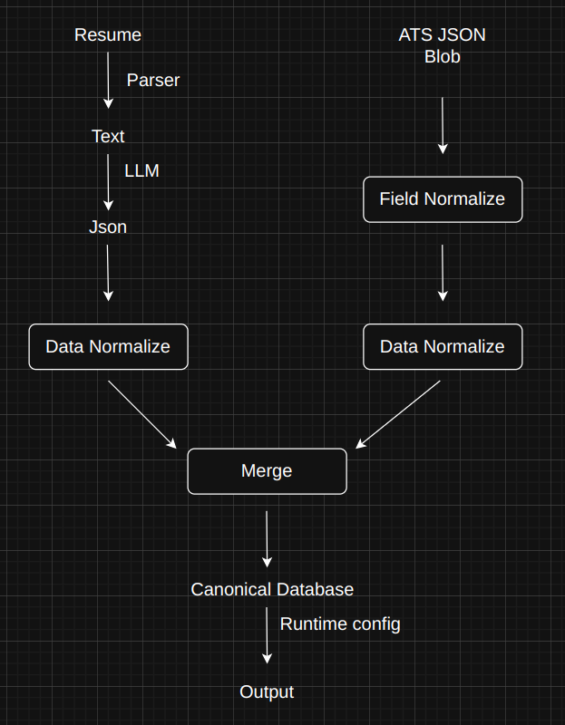

# Perceptor: Candidate Data Normalization Pipeline

Perceptor is a multi-source candidate data transformer. It extracts, normalizes, merges, and projects candidate profiles from resumes (PDFs) and ATS data (JSONs) into a customizable canonical schema.

---

## Getting Started

### 1. Clone the Repository
Clone the repository using Git and navigate to the project directory:
```bash
git clone https://github.com/vedanshbvb/perceptor.git
cd perceptor
```

### 2. Set Up a Virtual Environment & Install Dependencies
It is recommended to use a virtual environment to manage dependencies:
```bash
# Create a virtual environment
python -m venv .venv

# Activate the virtual environment
# On Linux/macOS:
source .venv/bin/activate
# On Windows:
.venv\Scripts\activate

# Install the required libraries
pip install -r requirements.txt
```

### 3. Get a Gemini API Key
To parse resume PDFs, the pipeline uses the Gemini 2.5 Flash model.
1. Visit the [Google AI Studio](https://aistudio.google.com/).
2. Sign in with your Google account.
3. Click on **Get API key** and create a new API key.
4. Create a file named `.env` in the root of the repository and add your API key:
   ```env
   GEMINI_API_KEY=your_api_key_here
   ```

### 4. Run the Streamlit Application
Launch the Streamlit web interface:
```bash
streamlit run app.py
```

---

## Technical Design

Perceptor is built on a modular pipeline architecture designed to handle raw candidate profiles from multiple unstructured/semi-structured sources and transform them into a clean, canonical format.



### Pipeline Components

#### 1. Parsers ([parsers.py](file:///home/vedansh/Documents/eightfold/perceptor-parent/perceptor/parsers.py))
- **Resume Parser (`parse_resume_pdf`)**: Extracts raw text from PDF files using `PyPDF2` and prompts the `gemini-2.5-flash` model to structure the profile according to a strict JSON schema.
- **Anti-Hallucination Engine (`verify_no_hallucinations`)**: A verification layer that checks the LLM's structured JSON against the original raw resume text. If entities (companies, institutions, skills) are not found in the original text, they are dropped to ensure high data integrity.
- **ATS Parser (`parse_ats_json`)**: Reads raw JSON blobs coming directly from Applicant Tracking Systems.

#### 2. Normalizers ([normalizers.py](file:///home/vedansh/Documents/eightfold/perceptor-parent/perceptor/normalizers.py))
- **Field Normalizer (`FieldNormalizer`)**: Standardizes diverse, source-specific keys (e.g. `contact_emails`, `email_addresses` or `first_last_name`) into a canonical set of internal schema keys (e.g., `full_name`, `emails`, `phone`).
- **Data Normalizer (`DataNormalizer`)**: Standardizes entity values by performing fuzzy and alias-based matching for:
  - Professional titles (e.g., matching `swe 1` or `sde 1` to `Software Development Engineer 1`)
  - Corporate entities (e.g., matching `google inc` or `alphabet` to `Google`)
  - Academic institutions (e.g., matching `iit bombay` to `Indian Institute of Technology Bombay`)
  - Degrees and fields of study (e.g., matching `b.tech` to `Bachelor of Technology`)
- **Normalized Outputs**: The outputs folder contains intermediate normalized files:
  - `outputs/<resume_filename>_normalized.json`
  - `outputs/<ats_filename>_normalized.json`

#### 3. Profile Merger ([merger.py](file:///home/vedansh/Documents/eightfold/perceptor-parent/perceptor/merger.py))
- Merges profile data from both Resume and ATS sources utilizing the candidate's standardized phone number as the primary key.
- Computes matching confidences between sources using Jaccard Similarity (Intersection over Union) across names, emails, links, skills, experiences, and academic backgrounds.
- Generates an `overall_confidence` score reflecting the alignment between sources.

#### 4. Projector ([projector.py](file:///home/vedansh/Documents/eightfold/perceptor-parent/perceptor/projector.py))
- Reshapes the merged profile dynamically based on runtime configurations specified in JSON format.
- Supports picking specific fields, using custom path mappings (e.g., extraction of the primary email from `emails[0]`), and handling missing values (omitting them or setting them to null).
- Saves final configured profiles into `outputs/canonical_profiles.json`.
